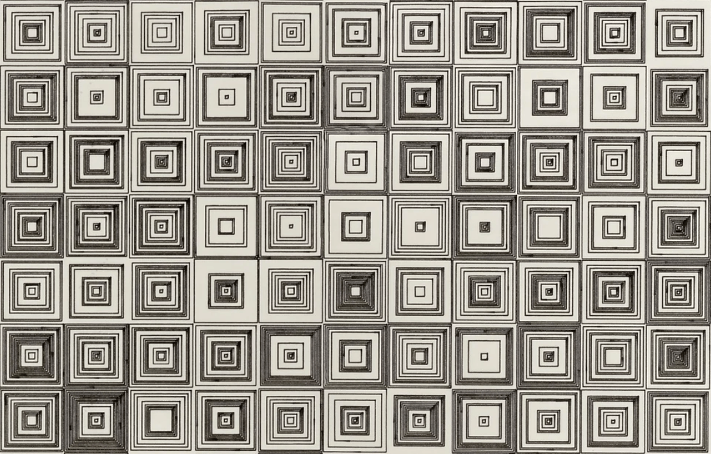

# Week 1 Homework

## Homework Prompt

Recreate one work by Vera Molnar using code.

## Original Work

Vera Molnar, De La Serie (Des) Ordres (detail), 1974.
Courtesy of The Anne and Michael Spalter Digital Art Collection

Found at: <https://www.rightclicksave.com/article/an-interview-with-vera-molnar>

<!-- Add image or description of the original work you're recreating -->

## Recreation

<!-- Add screenshots, GIFs, or description of your recreation -->

## Process Notes

My goal for the entire class assignment is to use TouchDesigner exclusively to recreate the original work. Why? Because (1) Many generative works are created in imperative pattern, but TD forces us to think in a declarative way (2) By remodeling the work into declarative space, exploring the "latent space" of the work becomes trivial by adjusting the parameters of the work. (3) I'm a bit tired of all the coding and I want to get better at TD.

<!-- Document your process, challenges, and discoveries -->

## Code

<!-- Link to your code in the homework/ folder -->

## Reading Reflection

<!-- One sentence from the assigned reading to share in class -->
