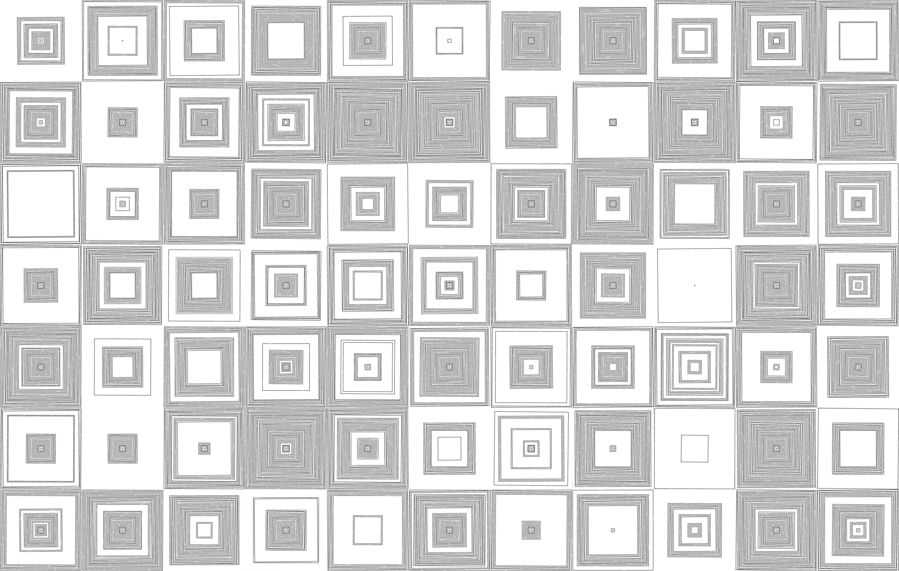
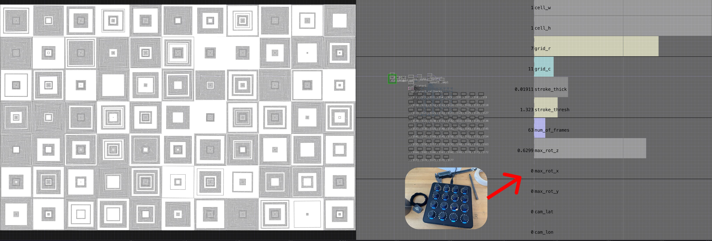
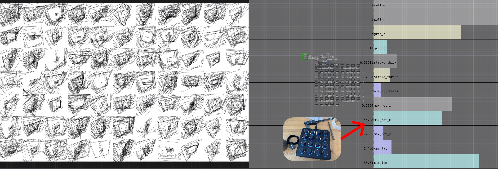

# Week 1 Homework

## Homework Prompt

Recreate one work by Vera Molnar using code.

## Original Work

Vera Molnar, De La Serie (Des) Ordres (detail), 1974.
Courtesy of The Anne and Michael Spalter Digital Art Collection

Found at: <https://www.rightclicksave.com/article/an-interview-with-vera-molnar>

<!-- Add image or description of the original work you're recreating -->

## Recreation

<!-- Add screenshots, GIFs, or description of your recreation -->

## Process Notes

My goal for the entire class assignment is to use TouchDesigner exclusively to recreate the original work. Why? Because (1) Many generative works are created in imperative pattern, but TD forces us to think in a declarative way (2) By remodeling the work into declarative space, exploring the "latent space" of the work becomes trivial by adjusting the parameters of the work. (3) I'm a bit tired of all the coding and I want to get better at TD.

<!-- Document your process, challenges, and discoveries -->

I model each "cell" in the grid individually as a reusable component. I used a moving noise with thresholding to control whether to draw a square line or not given a sample rate. And I generate a bunch of them in a grid layout. My composition don't look quite as nice as the original because each cell are randomly generated and there's no control of the overall harmony. I found it hard to associate different instances of the same compoenent from a single source of data (instancing in TD assumes standard 3D transformation, and other flexible ways (Replicator) to instance is quite cumbersome). Unfortunately, each cell is seeded by a different index number without knowing each other.

But the square lines are modeled in 3D space, which is natural in TD. And that gives us the ability to control lots of stuff in the scene.

## Reading Reflection

<!-- One sentence from the assigned reading to share in class -->

> The computer draws, my eyes see, my hand draws, the computer is programmed by Jeff, the computer draws...in an endless productive cycle.

> A line carves out form on a white sheet of paper, a line carves out implied visual space. A line is an abstract element which I have seen and explored. A line is grass or the edge of a leaf, a shape, a symbol. The line does not exist, it can be drawn.

> The pre-camera, pre-computer Chinese artist took a life-time of understanding in order to make one meaningful ink filled brushstroke. It may take a life-time to develop a computer program to make one new communicating pen line which is meaningful for us.
