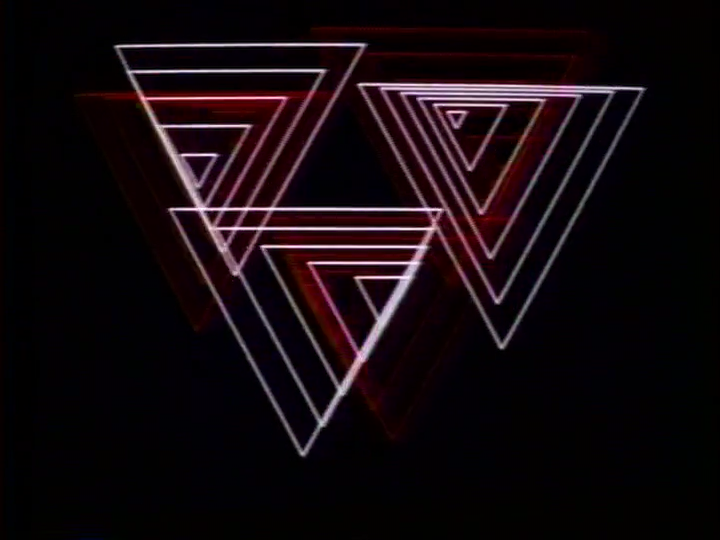
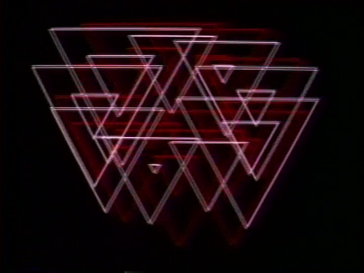

# Week 2 Homework

## Homework Prompt

Recreate one work by John Whitney using code.

## Original Work

John Whitney, _Matrix III_, 1972. Whitney's film features polygonal shapes—triangles, squares, pentagons—driven by sine wave functions, rotating and transforming in mesmerizing harmonic motion.

## Recreation

## Process Notes

Continuing my commitment from [Week 1](../week-1/homework.md) to use TouchDesigner exclusively, I recreated Whitney's sine wave–driven 2D polygon shapes from _Matrix III_. The polygonal forms rotate, scale, and translate according to sinusoidal functions, mimicking the harmonic motion that defines Whitney's work.

Honestly, this is a pretty rough recreation - it definitely looks like something made in the 21st century rather than capturing the analog warmth of Whitney's original. I used MIDI knobs to control the sine wave characteristics (frequency, amplitude, phase), which gave me real-time performative control over the animation. In hindsight, I probably should have used another sine wave to drive those parameters instead which would have produced a more organic, self-similar motion closer to Whitney's approach.

This project was also a chance to learn TouchDesigner's new POP (Particle Operator) system. All the instancing runs on the GPU, which keeps the performance smooth even with a large number of polygon instances on screen.

**Details:**
The core idea is an array of 3D polygon shapes whose positions are controlled by independent x, y, and z sine waves. The TouchDesigner network exposes MIDI-mapped parameters (visible on the left: `period_x/y/z`, `amp_x/y/z`, `speed_x/y/z`, `poly_div`, `sample_rate`, `poly_size`) to drive these sine waves in real time. Since everything lives in 3D, the z-axis adds dynamic scale variation as polygons move closer to and further from the camera. The `poly_div` parameter controls the polygon's number of sides, turning each shape into an arbitrary n-gon—triangles at 3, squares at 4, approaching circles as it climbs higher. Again, this is the declarative approach: rather than drawing each shape type separately, I just expose a single parameter and let the system figure out the geometry. I also added some post-processing (bloom, feedback, color grading) to try to give it a more analog feel.

## Code

See [homework/](./homework/) for the TouchDesigner project files.

## Reading Reflection

> Having a train come diagonally across the screen as if right at the viewer or making use of rapid-cutting to expand uponthe time-space continuum are exhilarating cinematic experiences, but they are nowhere near as intellectually demanding as the expressive and distinct movement of colored shapes across the filmic plane.

> As one begins to understand the achievements of the abstract cinema, it becomes very apparent that complex ideas of great significance can be articulated solely through movement.

— Bruce Posner, _Legacy Alive: An Introduction_
