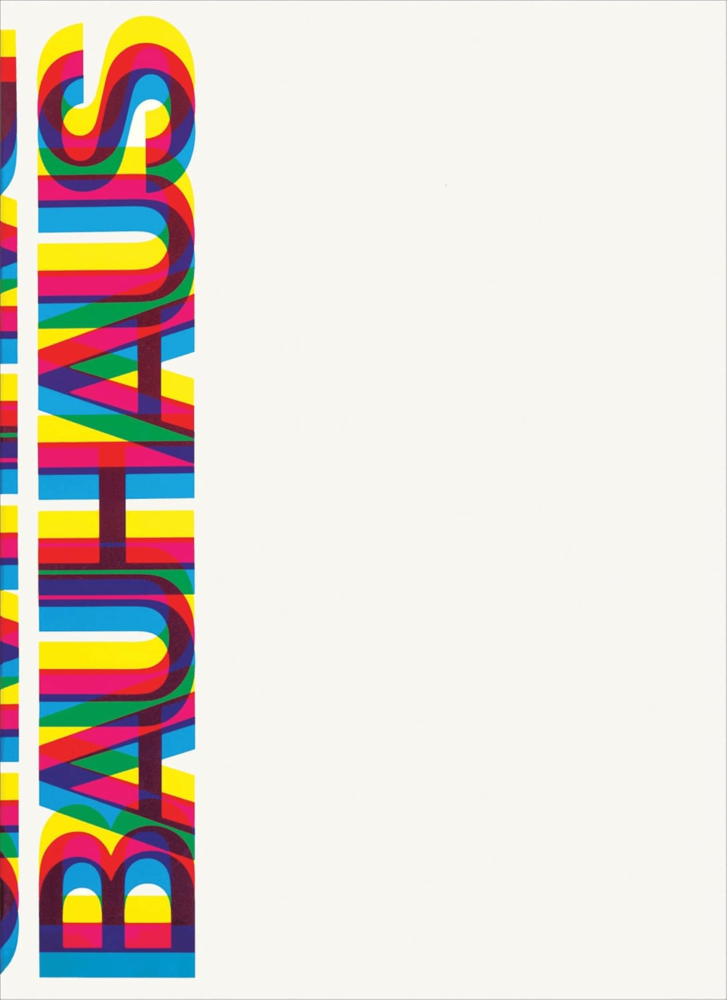
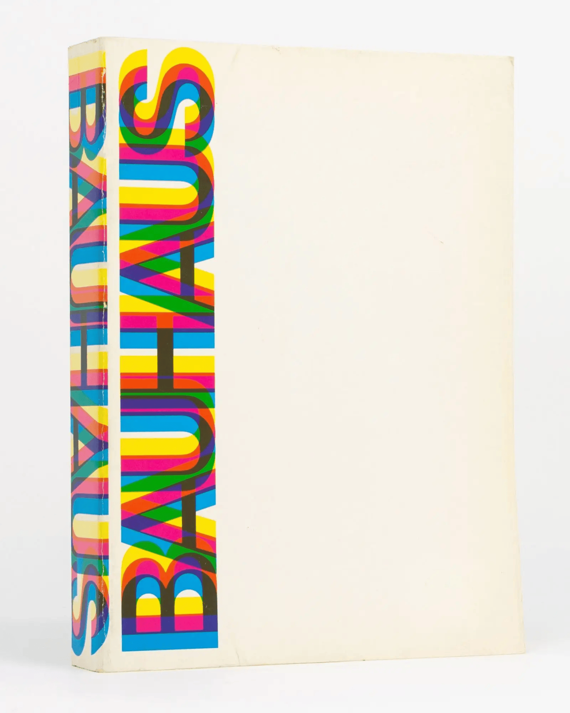
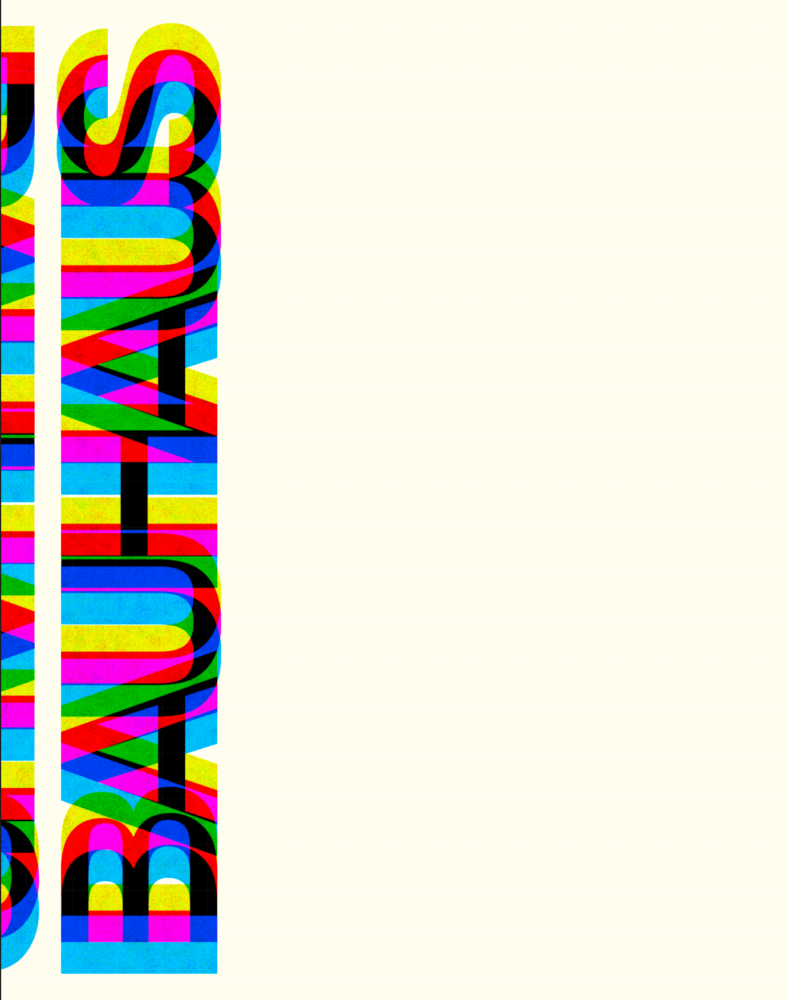
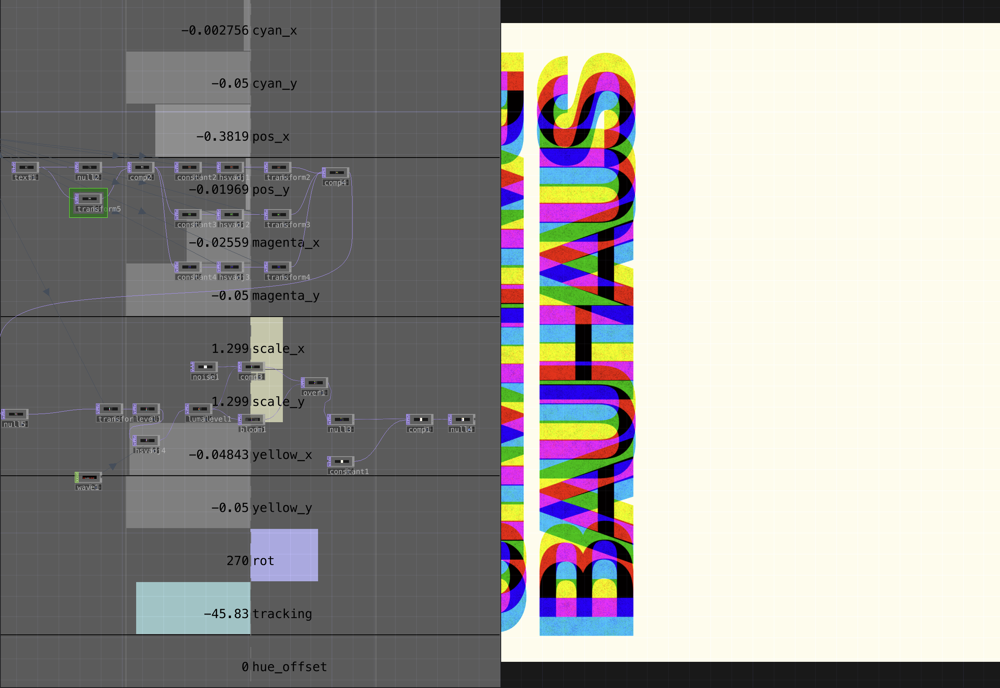
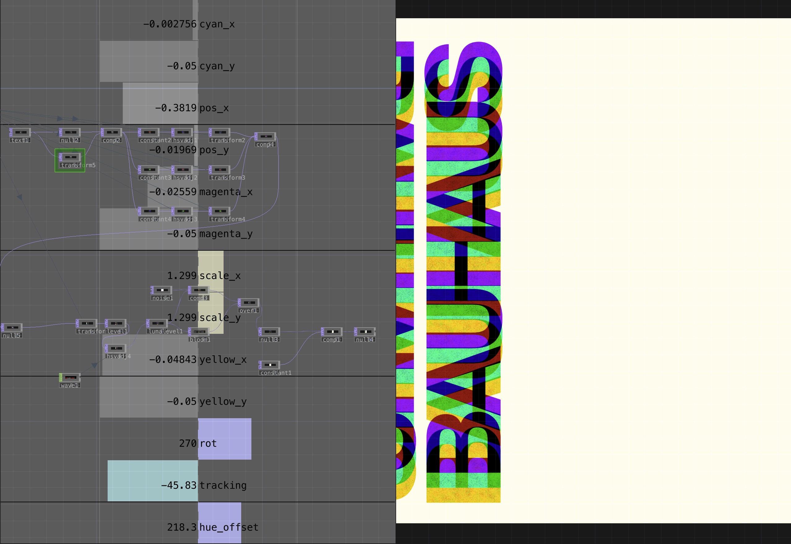

# Week 3 Homework

## Homework Prompt

Recreate one work by Muriel Cooper or John Maeda using code.

## Original Work

Muriel Cooper, book cover for _Bauhaus: Weimar, Dessau, Berlin, Chicago_ by Hans M. Wingler, 1969. Published by MIT Press.

Cooper's cover for the definitive Bauhaus anthology is one of the most iconic pieces of American graphic design. The word "BAUHAUS" is printed in a bold, rounded sans-serif set vertically, then overprinted multiple times in process colors — cyan, magenta, yellow, and black — each pass slightly offset from the last. The overlapping inks mix into a dense, vibrant spectrum of secondary and tertiary colors. It's essentially CMYK registration pushed to expressive extremes: the same technique that makes four-color printing invisible is made into the entire visual statement.

The actual printed book differs from the more commonly circulated poster version. On the physical object, the BAUHAUS lettering runs down the spine and wraps partially onto the front cover, creating two adjacent columns of overprinted text — the narrower spine on the left, and a wider strip where the cover begins on the right — separated by the fold of the binding. The rest of the cover is blank cream.

Source: [Alliance Graphique Internationale (AGI) — Muriel Cooper: The Bauhaus](https://a-g-i.org/design/the-bauhaus)

## Recreation

## Process Notes

Continuing my commitment to use TouchDesigner exclusively, I recreated Cooper's Bauhaus cover by modeling the color separation and deliberate misregistration process that defines the original design. In the print world, Cooper's technique is offset overprinting with intentional registration error — running the same plate through the press multiple times in different process inks (cyan, magenta, yellow, black), each pass slightly misaligned from the last so the separations become visible. The digital equivalent is often called chromatic aberration, but the print lineage is really color separation pushed into expressive territory.

**The technical approach:** Rather than working in subtractive CMY directly (which is messy to composite in a GPU texture pipeline), I render the text in additive RGB and invert the result. This gives me a clean base plate with proper alpha as a TOP — the inversion maps RGB additive mixing back to the CMY subtractive behavior of real ink overlap. I render the word "BAUHAUS" four times — one layer per separation color plus a black key plate — and offset each layer's position independently. When the inverted RGB layers stack, the overlap colors emerge naturally: cyan + magenta regions become blue, cyan + yellow become green, magenta + yellow become red, all three approach black.

The TouchDesigner network exposes sliders for each color channel's x/y offset (`cyan_x`, `cyan_y`, `magenta_x`, `magenta_y`, `yellow_x`, `yellow_y`), plus global controls for position (`pos_x`, `pos_y`), scale (`scale_x`, `scale_y`), rotation (`rot` — set to 270° for the vertical orientation), and letter `tracking`. This makes the whole design a continuous parameter space: I can scrub from perfectly registered (flat black text) through subtle misregistration (the original cover) to wild, explosive offsets — all in real time. The animated demo shows this exploration.

I also added a `hue_offset` parameter that rotates the entire color palette in HSV space. At `hue_offset = 0` the output matches Cooper's original CMY palette; crank it to 218° and the composition shifts into a completely different register — purples, greens, olive-golds — while preserving the same structural relationships between the separations.

**What went well:**
The inverted-RGB compositing approach maps cleanly to Cooper's actual production technique, and the color mixing is surprisingly faithful — the secondary colors emerge naturally from the overlap rather than being hand-placed. The `hue_offset` parameter was a bonus: it lets me explore the full gamut of what Cooper's composition _could_ look like in different color worlds, which feels true to the declarative spirit of this whole TouchDesigner approach. I chose the printed book composition (spine + front cover, two columns) over the poster version since that's the actual designed object.

I also blended some temporal noise into the text layers to give the surface a paper-like grain that shifts over time. It doesn't match the original 1:1 — Cooper's texture comes from real ink on real paper — but it makes the piece much more interesting to look at as a real-time visual, adding a subtle liveliness that a flat digital render would lack.

**What could be better:**
The typeface itself was straightforward — Cooper set the original in Helvetica Bold, which was still a relatively new face in 1969. The real cover has subtle ink texture and paper grain from the offset lithography process that I haven't fully captured here, though the temporal noise helps close that gap.

## Code

See [homework/](./homework/) for the TouchDesigner project files.

## Reading Reflection

<!-- One sentence from the assigned reading (Bruno Munari, "The Shape of Words" / "Poems and Telegrams") to share in class -->
