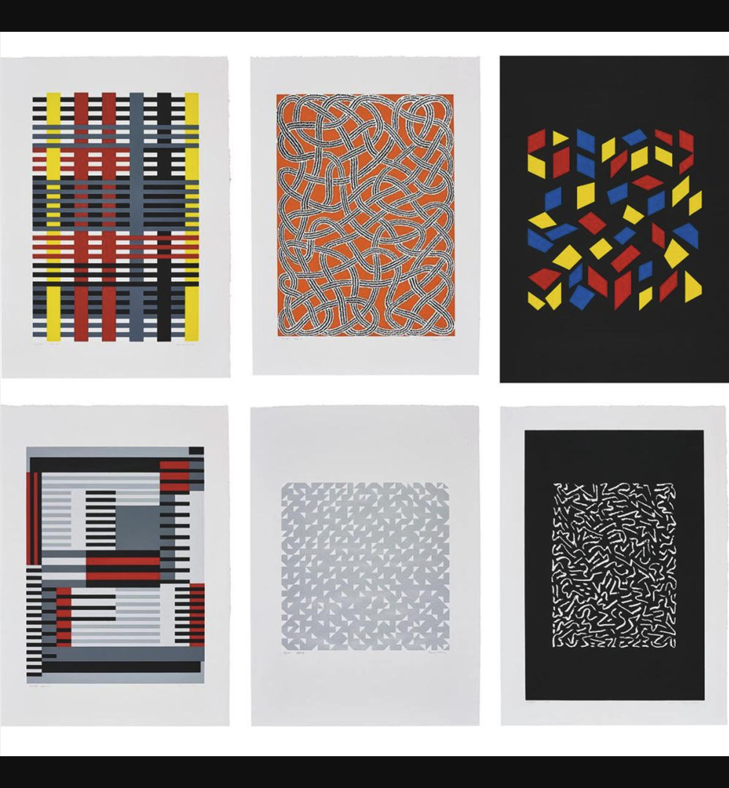
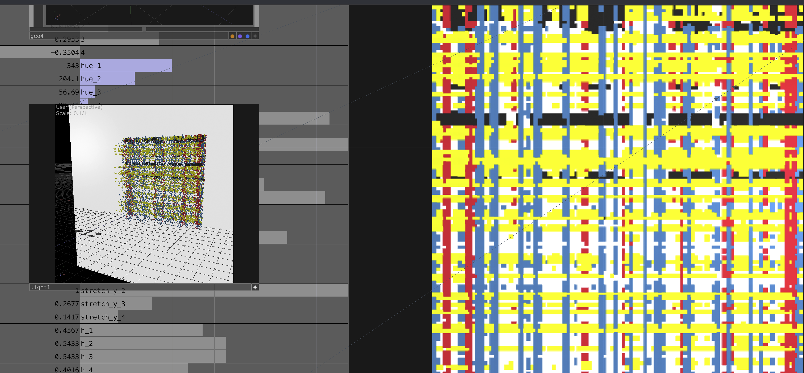
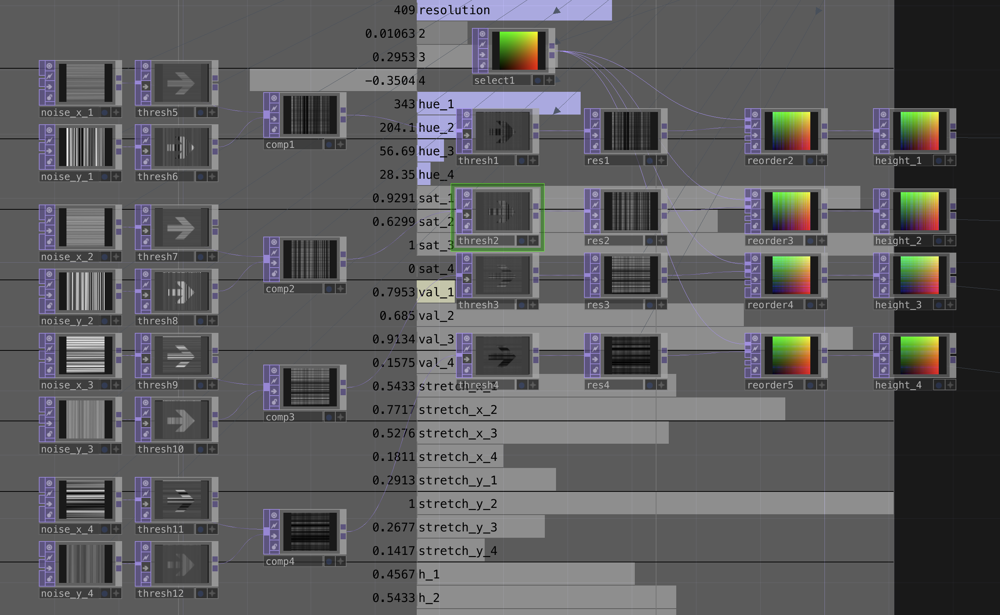
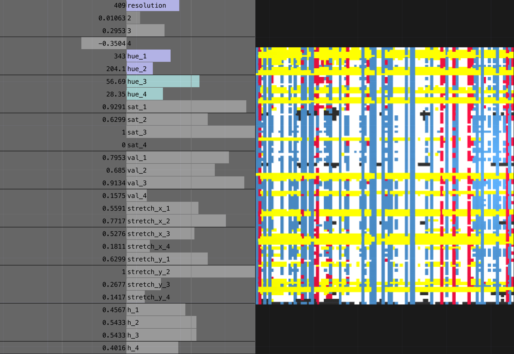

# Week 4 Homework

## Homework Prompt

Recreate one work by Anni Albers, Odili Donald Odita, or Bridget Riley using code.

## Original Work

Anni Albers, two screenprints from _Connections_, 1925/1983. Portfolio of nine screenprints. Sold for £13,000 GBP via Phillips (September 2019).

I'm referencing the left two prints from the portfolio. Both are built on the structural logic of weaving — horizontal and vertical strips interlocking across a plane — but they express that logic differently. The top-left piece is a tightly ordered grid where colored bands in yellow, red, dark navy, black, and white pass over and under each other in a strict warp-and-weft rhythm. The bottom-left is looser: overlapping rectangular planes filled with horizontal stripes, layered architecturally so that depth comes from occlusion rather than interlacement. What unites them is Albers' core idea — the loom's horizontal/vertical vocabulary, color interaction at crossings, repetition with variation — used as raw material for abstract composition.

Source: [Invaluable — Anni Albers: Weaving Modernism into Art and Design](https://www.invaluable.com/blog/anni-albers/)

## Recreation

## Process Notes

Continuing with TouchDesigner, I approached Albers' weaving grids by trying to model the structural principle behind them: overlapping vertical and horizontal strips, each in a distinct color, layered to produce the woven surface. Rather than encoding the exact strip positions from the original, I built a generative system that could produce weaving-like compositions from noise — a starting point for the kind of ordered interlacement Albers achieves, even if the output lands somewhere more chaotic.

**The technical approach:** The network generates four color layers — corresponding to Albers' yellow, red, blue, and black — plus a white background plane sitting at the center. Each layer's weaving pattern is constructed by multiplying a vertical noise texture against a horizontal noise texture, both thresholded to produce binary strip masks. The multiplication is what gives the grid its woven quality: a strip only appears where both its vertical and horizontal components are active, mimicking how a thread in a real weave is only visible where it passes over the crossing thread.

These binary masks then drive 3D displacement maps on layered geometry, pushing each color layer forward or back in z-space. The result is a relief surface where the colored strips physically sit above or below each other — an attempt to capture the actual dimensionality of woven cloth rather than flattening it to a 2D composite. The per-layer parameters expose full control over each color's appearance and structure: `hue`, `sat`, and `val` control the color in HSV space; `stretch_x` and `stretch_y` scale the noise frequency independently per axis (wider stretch = fewer, broader strips); and `h` sets the displacement height. A global `resolution` parameter controls the noise grid density across all layers simultaneously.

**What went well:** The noise-multiplication approach does produce genuinely woven-looking structures — the grid emerges naturally from the vertical × horizontal interaction rather than being hard-coded, and the 3D displacement adds a materiality that a flat composite wouldn't have. The parameter space is wide enough that very different compositions come out of the same system: sparse, ribbon-like arrangements at low resolution; dense, saturated fields at high resolution. The color palette — yellow, red, blue, black on white — maps directly to Albers' original, and the HSV controls let me shift it freely.

**What could be better:** The output reads more Mondrian-by-way-of-static than Bauhaus. Albers' originals have a deliberate, almost mechanical order — every strip width, every color placement is a decision — while my noise-driven system is fundamentally stochastic. It's a valid generative framework, but the gap between noise and intention is where the real work of Albers lives. I also ran into resolution upscaling artifacts: when the noise is generated at a lower resolution and scaled up to the final output, the strips lose their clean edges and pick up staircase-like jaggedness. I mitigated this as much as I could, but the strips never quite achieve the ruler-straight crispness of the originals. A next step would be to replace the noise with a rule-based strip generator — encoding specific widths, spacings, and color sequences — so the system could produce compositions that are _ordered_ the way Albers' are, not just structurally similar.

## Code

See [homework/](./homework/) for the TouchDesigner project files.

## Reading Reflection

> It reminds me that colour is not just only an item to fill identification of a space but it is used to really make the world new and again, make the world new and again.

From [Missla Libsekal - Savvy Art Contemporary African](https://www.stevenson.info/sites/default/files/2011_missla_libsekal_savvy_art_contemporary_african_2011.pdf)
